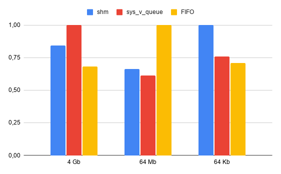

## Сводная таблица всех замеров времени (в секундах)

<table>
  <thead>
    <tr>
      <th rowspan="2">Конфигурация</th>
      <th rowspan="2">№</th>
      <th>SHM (сек)</th>
      <th>SYS_V_QUEUE (сек)</th>
      <th>FIFO (сек)</th>
    </tr>
  </thead>
  <tbody>
    <tr>
      <td rowspan="8"><b>4 ГБ файл / 16 МБ буфер</b></td>
      <td>1</td><td>2.847</td><td>3.116</td><td>2.158</td>
    </tr>
    <tr><td>2</td><td>2.700</td><td>3.142</td><td>2.312</td></tr>
    <tr><td>3</td><td>2.792</td><td>3.097</td><td>2.200</td></tr>
    <tr><td>4</td><td>2.622</td><td>3.484</td><td>2.050</td></tr>
    <tr><td>5</td><td>2.560</td><td>3.134</td><td>2.205</td></tr>
    <tr><td>6</td><td>2.696</td><td>3.537</td><td>2.196</td></tr>
    <tr><td>7</td><td>2.833</td><td>3.146</td><td>2.291</td></tr>
    <tr><td><b>Среднее</b></td><td><b>2.721</b></td><td><b>3.237</b></td><td><b>2.202</b></td></tr>
    <tr>
      <td rowspan="8"><b>64 МБ файл / 64 КБ буфер</b></td>
      <td>1</td><td>0.03041</td><td>0.01809</td><td>0.04539</td>
    </tr>
    <tr><td>2</td><td>0.02526</td><td>0.03073</td><td>0.03935</td></tr>
    <tr><td>3</td><td>0.02716</td><td>0.02248</td><td>0.04191</td></tr>
    <tr><td>4</td><td>0.02694</td><td>0.03113</td><td>0.03683</td></tr>
    <tr><td>5</td><td>0.02674</td><td>0.03016</td><td>0.03828</td></tr>
    <tr><td>6</td><td>0.02642</td><td>0.01966</td><td>0.04321</td></tr>
    <tr><td>7</td><td>0.02671</td><td>0.02077</td><td>0.03712</td></tr>
    <tr><td><b>Среднее</b></td><td><b>0.02709</b></td><td><b>0.02472</b></td><td><b>0.04030</b></td></tr>
    <tr>
      <td rowspan="8"><b>64 КБ файл / 64 КБ буфер</b></td>
      <td>1</td><td>0.00084</td><td>0.00062</td><td>0.00042</td>
    </tr>
    <tr><td>2</td><td>0.00088</td><td>0.00033</td><td>0.00034</td></tr>
    <tr><td>3</td><td>0.00050</td><td>0.00042</td><td>0.00038</td></tr>
    <tr><td>4</td><td>0.00042</td><td>0.00070</td><td>0.00039</td></tr>
    <tr><td>5</td><td>0.00046</td><td>0.00048</td><td>0.00060</td></tr>
    <tr><td>6</td><td>0.00059</td><td>0.00028</td><td>0.00044</td></tr>
    <tr><td>7</td><td>0.00041</td><td>0.00028</td><td>0.00034</td></tr>
    <tr><td><b>Среднее</b></td><td><b>0.00059</b></td><td><b>0.00044</b></td><td><b>0.00042</b></td></tr>
  </tbody>
</table>

## Сводные матрицы производительности (Средние значения и Нормированные)

### 1. Таблица среднего времени выполнения (в секундах)

| Механизм IPC | 4 Gb (16 Mb буфер) | 64 Mb (64 Kb буфер) | 64 Kb (64 Kb буфер) |
| :--- | :---: | :---: | :---: |
| **shm** | 2.721428571 | 0.026710000 | 0.0005857142857 |
| **sys_v_queue** | 3.236571429 | 0.02471714286 | 0.0004442857143 |
| **FIFO** | 2.201714286 | 0.04029857143 | 0.0004157142857 |
| **max** | 3.236571429 | 0.04029857143 | 0.0005857142857 |

### 2. Таблица относительной эффективности (доля от худшего результата `max = 1`)

| Механизм IPC | 4 Gb | 64 Mb | 64 Kb |
| :--- | :---: | :---: | :---: |
| **shm** | 0.8408368644 | 0.6628026516 | 1.0000000000 |
| **sys_v_queue** | 1.0000000000 | 0.6133503492 | 0.7585365854 |
| **FIFO** | 0.6802612994 | 1.0000000000 | 0.7097560976 |

