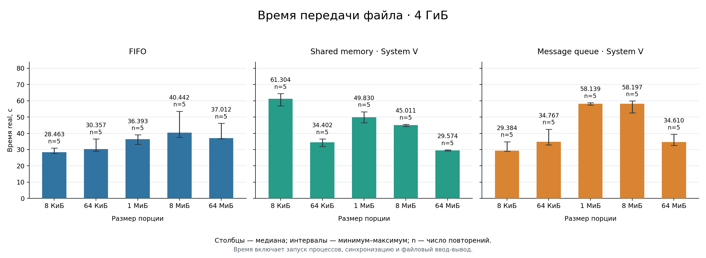

# Измерение скорости передачи 
Измерялась скорость передачи файла из одного процесса в другой при помощи различных ipc таких, как SYS V sharedMemory, SYS V queue, FIFO.

# Запуск бенчмарка 
```sh
# увеличим максимальный размер очереди и сообщения в ней  
sudo sysctl -w kernel.msgmax=2097152
sudo sysctl -w kernel.msgmnb=8388608
```

Непосредственно запуск:
```sh
# увеличим максимальный размер очереди и сообщения в ней. [аргумент] - аргумент не обязателен   
./runBenchmark.sh [кол-во повторений измерений] [размер файла]
```

Размер можно указать в байтах или с суффиксом `K`, `M`, `G`
(двоичные единицы: `4G` = 4 ГиБ = 4294967296 байт).
По умолчанию: 10 повторений и файл 64 МиБ.

```sh
# 3 измеряемых повтора для каждой комбинации IPC и размера порции, файл 4 ГиБ.
# Увеличиваем лимит одного приёма с 30 секунд до 5 минут.
BENCHMARK_TIMEOUT=300s bash ./runBenchmark.sh 3 4G
```

Для исходного и выходного файлов потребуется как минимум 8 ГиБ свободного
места. Получатель пока собирает весь файл в оперативной памяти, поэтому
для такого теста также нужен запас RAM.

# Результаты
При помощи набора скриптов выполняются измерения и сохраняются в папке [benchmark](benchmark/).
Основной интерес представляет сгенерированная диаграмма по результатам измерений:

<p align="center">
  
</p>


